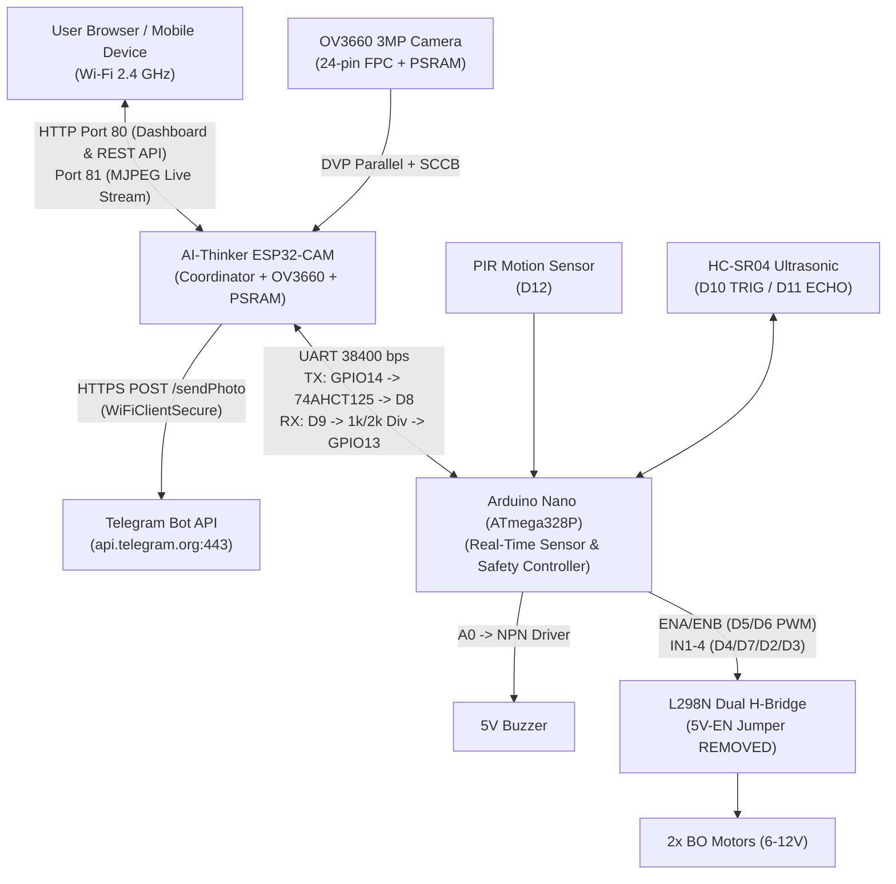

# System Block Diagram — ESP32-CAM Autonomous Surveillance Robot

```mermaid
flowchart TB
    USER["User Browser / Mobile Device<br/>(Wi-Fi 2.4 GHz)"] <-->|"HTTP Port 80 (Dashboard & REST API)<br/>Port 81 (MJPEG Live Stream)"| ESP["AI-Thinker ESP32-CAM<br/>(Coordinator + OV3660 + PSRAM)"]

    CAM["OV3660 3MP Camera<br/>(24-pin FPC + PSRAM)"] -->|"DVP Parallel + SCCB"| ESP
    ESP -->|"HTTPS POST /sendPhoto<br/>(WiFiClientSecure)"| TG["Telegram Bot API<br/>(api.telegram.org:443)"]

    ESP <-->|"UART 38400 bps<br/>TX: GPIO14 -> 74AHCT125 -> D8<br/>RX: D9 -> 1k/2k Div -> GPIO13"| NANO["Arduino Nano (ATmega328P)<br/>(Real-Time Sensor & Safety Controller)"]

    PIR["PIR Motion Sensor<br/>(D12)"] --> NANO
    US["HC-SR04 Ultrasonic<br/>(D10 TRIG / D11 ECHO)"] <--> NANO
    NANO -->|"A0 -> NPN Driver"| BUZ["5V Buzzer"]
    NANO -->|"ENA/ENB (D5/D6 PWM)<br/>IN1-4 (D4/D7/D2/D3)"| L298N["L298N Dual H-Bridge<br/>(5V-EN Jumper REMOVED)"]
    L298N --> M["2x BO Motors (6-12V)"]
```
